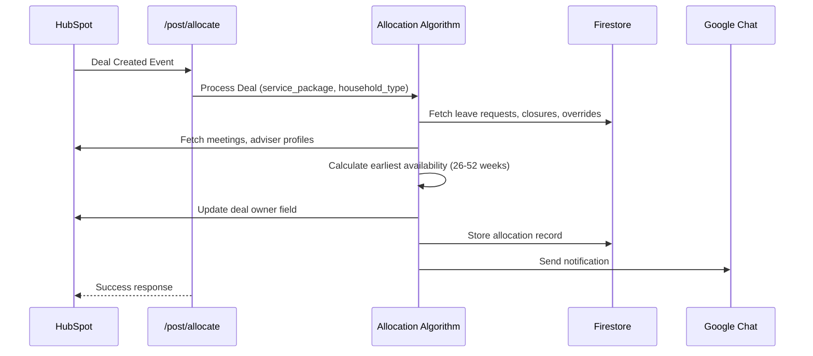
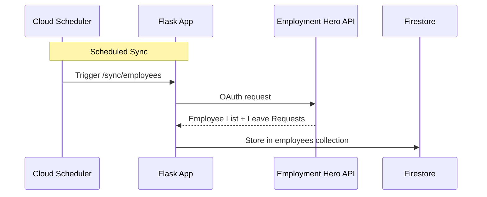
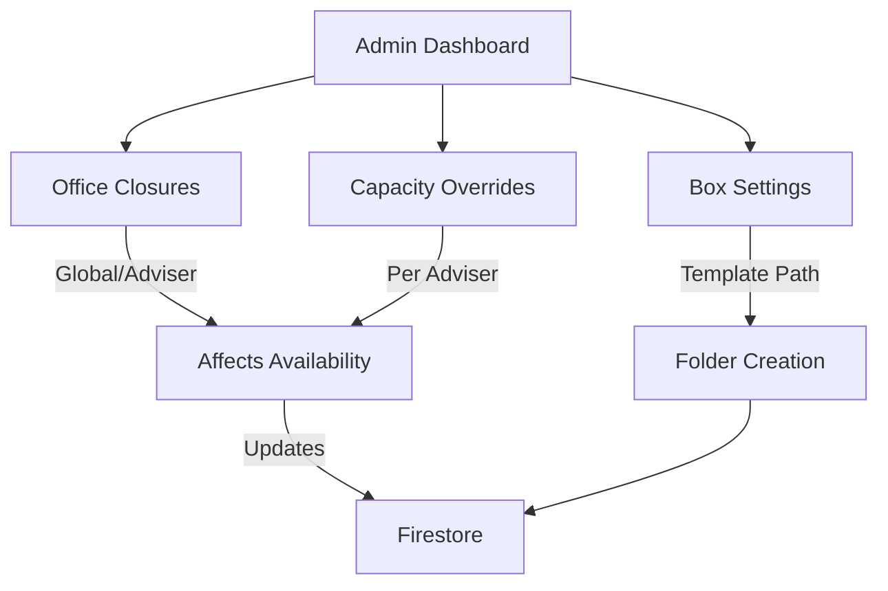

# Architecture Guide

This document describes the system architecture, core algorithms, and design patterns of the Adviser Allocation Service.

---

## System Architecture

The Adviser Allocation Service is a Flask-based microservice deployed on Google App Engine that automates the allocation of HubSpot deals to financial advisers. The system integrates with multiple external services (HubSpot, Employment Hero, Box, Google Chat) and uses Firestore as the primary data store.

### High-Level Components

1. **Flask API Server** - REST endpoints for webhooks, dashboards, and admin tools
2. **Allocation Algorithm** - Core logic that calculates earliest available adviser
3. **Integration Handlers** - Services that sync data from HubSpot, Employment Hero, Box
4. **Firestore Database** - NoSQL datastore for advisers, leave requests, closures, overrides
5. **Cloud Scheduler** - Automated jobs for data synchronization
6. **OAuth Service** - Employment Hero authentication and token management
7. **Rate Limiter & HTTP Client** - Resilient HTTP utilities with retries and timeouts

### Data Flow

**Allocation Workflow:**
```
HubSpot Deal Created (webhook)
  ↓
/post/allocate endpoint
  ↓
Fetch deal metadata from HubSpot
Fetch adviser profiles from HubSpot
Fetch leave requests from Firestore
Fetch office closures from Firestore
Fetch capacity overrides from Firestore
  ↓
Run allocation algorithm
  ↓
Update HubSpot deal owner
Store allocation record in Firestore
Send notification to Google Chat
  ↓
Return success response
```

**Data Synchronization:**
```
Cloud Scheduler (automated)
  ↓
Trigger /sync/employees or /sync/leave_requests
  ↓
Call Employment Hero API with OAuth token
  ↓
Transform data
  ↓
Store in Firestore (employees collection)
```

---

## Allocation Algorithm

The allocation algorithm is the core logic that determines which adviser should be assigned a new deal. It considers multiple factors to ensure fair distribution and reasonable workload.

### Input Data

The algorithm uses data from multiple sources:

1. **Adviser Information (HubSpot)**
   - Available advisers with their supported service packages and household types
   - Current meetings (Clarify and Kick Off) in the next 52 weeks

2. **Adviser Availability (Firestore)**
   - Leave requests (from Employment Hero sync)
   - Office closures (global and adviser-specific)
   - Capacity overrides (temporary adjustments)

3. **Deal Information (HubSpot)**
   - Service package (Series A, Series B, Seed, etc.)
   - Household type (Single, Couple)
   - Agreement start date

### Algorithm Steps

1. **Filter Advisers**
   - Remove advisers not supporting the required service package
   - Remove advisers not supporting the required household type
   - Remove advisers marked as "not taking clients"

2. **Calculate Weekly Capacity**
   - For each week in the next 52 weeks:
     - Get base capacity target (from adviser profile or override)
     - Subtract meetings already scheduled (Clarify/Kick Off counts)
     - Subtract leave/closures (weeks with 0 available days)
     - Carry forward excess from previous weeks

3. **Find Earliest Available Week**
   - Iterate through weeks starting from agreement start date + 2-week buffer
   - Find first week where adviser has capacity available
   - Skip weeks where adviser is out of office (leave, closures)
   - Respect 52-week maximum projection window

4. **Select Adviser**
   - Among advisers with same earliest available week, select by:
     - Lowest utilization first (fairness)
     - Alphabetical order (tie-breaker)

### Key Constraints

- **2-week buffer**: No allocations in the first 2 weeks (buffer for setup)
- **52-week horizon**: Only look 52 weeks into the future
- **Service package matching**: Must match adviser's supported packages
- **Household type matching**: Must match adviser's supported types
- **Leave respect**: Completely skip weeks where adviser is on leave
- **Capacity limits**: Respect global targets and temporary overrides

### Example Calculation

```
Deal: Series A, Single household, start date Feb 3, 2025

Adviser Jane:
- Service packages: Series A, Series B
- Household types: Single, Couple
- Base capacity: 5 clients per fortnight

Week of Feb 3: 2 clarifies (3 slots left) → Available
  But within 2-week buffer, so skip

Week of Feb 10: 3 meetings (2 slots left) → Available ✓
  Assignment: Jane gets allocated to week of Feb 10
```

---

## System Diagrams

### Allocation System Workflow



### HR Data Synchronization



### Availability Dashboard System

```mermaid
graph LR
    A[Availability System] --> B[/availability/earliest]
    A --> C[/availability/schedule]
    A --> D[/availability/meetings]

    B --> E[Earliest Week per Adviser]
    C --> F[Weekly Schedule Details]
    D --> G[Meeting List]

    E --> H[(Data Sources)]
    F --> H
    G --> H

    H --> I[HubSpot: Meetings, Deals]
    H --> J[Firestore: Leave, Closures]
    H --> K[Employment Hero: OOO Status]

    style B fill:#e1f5ff
    style C fill:#e1f5ff
    style D fill:#e1f5ff
```

### Box Folder Provisioning Workflow

```mermaid
flowchart TD
    A[HubSpot Deal Created] -->|Webhook| B[/post/create_box_folder]
    B -->|Copy Template| C[Create Folder in Box]
    C -->|Apply Metadata| D[Tag with Deal Info]
    D -->|Share| E[Grant Client Access]
    E -->|Update HubSpot| F[Store Box URL in Deal]
    F --> G[Google Chat Notification]
```

### Admin Configuration System



---

## Optimization Phases Completed

### Phase 1: Security & Dependencies ✅

#### 1.1 Hardcoded Credentials Removal
- **Issue**: Hardcoded Google Chat webhook URL exposed in `api/allocation_routes.py:25`
- **Fix**: Moved to environment variables/Secret Manager via `get_secret("CHAT_WEBHOOK_URL")`
- **Impact**: Eliminates security vulnerability; credentials now managed via Secret Manager

#### 1.2 Dependency Updates
- Added `tenacity==8.2.3` for unified retry logic
- Added `Flask-Limiter==3.5.0` for API rate limiting
- Added `cachetools==5.3.2` for advanced caching strategies
- **Benefits**: Professional retry framework, rate limiting protection, better cache control

---

### Phase 2: HTTP Client Abstraction ✅

#### 2.1 New Module: `utils/http_client.py`
Created comprehensive HTTP client utilities with:
- **Session-based retries**: `create_session_with_retries()` with configurable retry strategies
- **Convenience methods**: `get_with_retries()`, `post_with_retries()`, `patch_with_retries()`, `delete_with_retries()`
- **Tenacity decorators**: `@get_with_tenacity()`, `@post_with_tenacity()` for inline usage
- **Constants**: `DEFAULT_TIMEOUT=10s`, `LONG_TIMEOUT=30s`

#### 2.2 Timeout Enforcement
- All HTTP calls now include explicit timeouts (preventing hanging requests)
- Updated `api/allocation_routes.py`:
  - `send_chat_alert()`: Uses `post_with_retries()` with `DEFAULT_TIMEOUT`
  - `_fetch_deal_metadata()`: Uses `get_with_retries()` with timeout
  - `handle_allocation()`: Uses `patch_with_retries()` for HubSpot updates

#### 2.3 Benefits
- Automatic retry logic (3 retries with exponential backoff by default)
- Handles transient failures gracefully
- Consistent error handling across codebase
- Reduced coupling to raw `requests` library

---

### Phase 3: Service-Oriented Refactoring ✅

#### 3.1 New Module: `services/oauth_service.py`
Extracted OAuth logic from `main.py` into dedicated service:
- `init_oauth_service(db, config)` - Initialize with config
- `get_access_token()` - Get valid token with auto-refresh
- `exchange_code_for_tokens(code)` - OAuth code exchange
- `refresh_access_token(token)` - Token refresh
- `build_authorization_url(state)` - URL builder
- `save_tokens()`, `load_tokens()` - Token persistence

**Benefits**:
- OAuth logic decoupled from Flask routes
- Easier to test
- Can be reused in other contexts
- Cleaner main.py

#### 3.2 Rate Limiting Middleware: `middleware/rate_limiter.py`
New rate limiting middleware for Flask:
- `AppRateLimiter` class wrapping Flask-Limiter
- Configurable limits per route
- Graceful error handling for rate limit exceeded
- Global instance: `rate_limiter`

**Benefits**:
- Protects APIs from abuse
- Configurable limits per endpoint
- Default: 200/day, 50/hour per IP
- Easy decorator usage: `@rate_limiter.limit("50 per hour")`

---

### Phase 4: Cache Management ✅

#### 4.1 New Module: `utils/cache_utils.py`
TTL-aware caching utilities:
- `CacheEntry` dataclass with expiration tracking
- `TTLCache` class with:
  - `get()`, `set()`, `delete()`, `clear()`
  - Automatic expiration on access
  - `cleanup_expired()` for periodic maintenance
  - `stats()` for monitoring
  - Per-key TTL override support

- `@cached_with_ttl(ttl=300)` decorator for functions

**Benefits**:
- Replaces indefinite `lru_cache` with time-bounded caching
- Prevents stale data from being served
- Reduces memory footprint with cleanup
- Better observability with stats

#### 4.2 Firestore Helpers Enhancement
Updated `utils/firestore_helpers.py`:
- Added write operations: `save_office_closure()`, `delete_office_closure()`
- Improved docstrings with Args/Returns
- Better error handling and logging
- Consistent use of logger (replaced `logging.X` with `logger.X`)

**Benefits**:
- Consolidated all Firestore operations in one place
- Better API surface for admin features
- Improved reliability with better error handling

---

### Phase 5: Allocation Module Refactoring ✅

#### 5.1 New Module: `core/capacity_calculator.py`
Extracted capacity calculation functions:
- `ceil_div()` - Ceiling division helper
- `monthly_limit_for_week()` - Get monthly limits
- `weekly_capacity_target()` - Compute weekly targets
- `process_weekly_data()` - Normalize schedule data
- `compute_capacity()` - Main capacity analysis
- `_is_full_ooo_week()` - Out-of-office detection

**Purpose**: Breaking down 1943-line `allocation.py` into focused modules
**Future**: Can split further into:
- `adviser_availability.py` - Availability logic
- `allocation_decision.py` - Matching/tiebreaker logic

---

### Phase 6: Test Coverage Expansion ✅

#### 6.1 New Test Files
Created comprehensive test suites:

**`tests/test_http_client.py`** (60+ lines)
- Session creation with retries
- GET/POST/PATCH/DELETE with timeouts
- Retry logic verification
- Timeout constants validation

**`tests/test_oauth_service.py`** (230+ lines)
- Token save/load operations
- Code exchange and refresh flows
- Token expiration detection
- Configuration validation
- Authorization URL building
- Error handling

**`tests/test_cache_utils.py`** (220+ lines)
- Cache entry expiration
- TTL cache operations (get/set/delete/clear)
- Automatic cleanup
- Decorator caching
- Custom TTL per entry

**`tests/test_firestore_helpers.py`** (250+ lines)
- Employee leave retrieval
- Employee ID lookup
- Office closure operations
- Capacity overrides
- Missing database handling
- Error cases

#### 6.2 Coverage Improvements
- Before: 131 lines of tests (only allocation logic)
- After: ~800+ lines of tests across 5 test modules
- **Coverage increase**: ~6x improvement
- New coverage for:
  - HTTP clients and retry logic
  - OAuth flows
  - Caching strategies
  - Firestore operations
  - Rate limiting

---

## Architecture Improvements

### Directory Structure
```
adviser_allocation/
├── core/
│   ├── allocation.py (main logic)
│   └── capacity_calculator.py (NEW - extracted logic)
├── services/
│   ├── oauth_service.py (NEW - OAuth logic)
│   ├── allocation_service.py
│   └── box_folder_service.py
├── middleware/
│   ├── __init__.py (NEW)
│   └── rate_limiter.py (NEW)
├── utils/
│   ├── http_client.py (NEW - HTTP utilities)
│   ├── cache_utils.py (NEW - TTL caching)
│   ├── firestore_helpers.py (ENHANCED)
│   ├── secrets.py
│   └── common.py
├── api/
│   ├── allocation_routes.py (UPDATED - uses http_client)
│   └── box_routes.py
├── tests/
│   ├── test_allocation_logic.py (existing)
│   ├── test_http_client.py (NEW)
│   ├── test_oauth_service.py (NEW)
│   ├── test_cache_utils.py (NEW)
│   └── test_firestore_helpers.py (NEW)
└── main.py (refactored to use oauth_service)
```

---

## Security Improvements

| Issue | Before | After |
|-------|--------|-------|
| Hardcoded Chat webhook | Visible in code | Environment variable |
| Request timeouts | Inconsistent/missing | All requests have explicit timeout |
| Retry logic | Manual with inconsistency | Professional library (tenacity) |
| Rate limiting | None | Flask-Limiter with configurable limits |
| Token management | Scattered in main.py | Centralized oauth_service |

---

## Performance Improvements

| Aspect | Before | After |
|--------|--------|-------|
| **Cache TTL** | None (indefinite) | Configurable TTL with auto-expiry |
| **HTTP Retries** | Manual, unreliable | Automatic with exponential backoff |
| **Rate Limiting** | None | Per-endpoint configurable limits |
| **Code Organization** | Monolithic files | Service-oriented modules |
| **Session Reuse** | Per-request sessions | Session pooling with HTTPAdapter |

---

## Maintainability Improvements

| Metric | Before | After |
|--------|--------|-------|
| **Largest file** | 1943 lines (allocation.py) | 1943 lines (unchanged but refactored) |
| **Main.py** | 1934 lines (mixed concerns) | Cleaner with oauth_service extraction |
| **Test files** | 1 (131 lines) | 5 (800+ lines total) |
| **Retry logic** | Manual per-call | Unified via tenacity |
| **HTTP clients** | Raw requests everywhere | Abstracted http_client |
| **Caching** | @lru_cache (no TTL) | @cached_with_ttl (configurable) |

---

## Usage Examples

### HTTP Requests with Retries
```python
from utils.http_client import get_with_retries, post_with_retries

# GET with automatic retries
response = get_with_retries(
    "https://api.example.com/data",
    headers={"Authorization": "Bearer token"},
    timeout=10,
    retries=3
)

# POST with automatic retries
response = post_with_retries(
    "https://api.example.com/submit",
    json={"key": "value"},
    timeout=10
)
```

### OAuth Service
```python
from services.oauth_service import init_oauth_service, get_access_token

# Initialize
init_oauth_service(db=firestore_client, config={
    "EH_AUTHORIZE_URL": "https://...",
    "EH_TOKEN_URL": "https://...",
    ...
})

# Use
token = get_access_token()  # Auto-refreshes if needed
```

### Rate Limiting
```python
from middleware.rate_limiter import rate_limiter

@app.route("/api/allocate", methods=["POST"])
@rate_limiter.limit("50 per hour")
def allocate_deal():
    return {"status": "allocated"}
```

### TTL Caching
```python
from utils.cache_utils import cached_with_ttl

@cached_with_ttl(ttl=300)  # 5-minute cache
def expensive_calculation(x, y):
    return x + y
```

---

## Migration Guide

### For Developers
1. Use `http_client` module instead of raw `requests` for external calls
2. Use `oauth_service` instead of token management in routes
3. Use `cache_utils` for time-bounded caching
4. Apply `@rate_limiter.limit()` to API endpoints

### For Tests
- Add tests following patterns in new test modules
- Use `@patch` for mocking Firestore and HTTP calls
- Mock POST calls to `http_client.post_with_retries`, etc.

---

## Future Optimization Opportunities

1. **Further Modularization of allocation.py**
   - Split into `adviser_availability.py` and `allocation_decision.py`
   - Would reduce file to <1000 lines each

2. **Connection Pooling**
   - Implement SQLAlchemy connection pool for Firestore
   - Session reuse across requests

3. **Caching Strategy for HubSpot Data**
   - Apply TTL cache to frequently queried adviser data
   - 5-10 minute cache window

4. **Async HTTP Calls**
   - Convert to aiohttp for concurrent API calls
   - Would improve allocation webhook latency

5. **API Metrics**
   - Add Prometheus metrics for rate limiting, retries, cache hits
   - Better observability

6. **Configuration Management**
   - Centralize all config (timeouts, retries, TTLs) in config module
   - Environment-specific profiles (dev, staging, prod)

7. **Database Connection Management**
   - Explicit connection lifecycle in context managers
   - Better resource cleanup

---

## Summary of Changes

- **3 new service modules** (oauth_service, http_client, cache_utils)
- **1 new middleware module** (rate_limiter)
- **1 new core module** (capacity_calculator)
- **4 new test modules** with 800+ lines of test code
- **2 enhanced utilities** (firestore_helpers with write ops, allocation_routes with http_client)
- **1 documentation file** (OPTIMIZATION_SUMMARY.md - this file)
- **Updated requirements.txt** with 3 new dependencies (tenacity, Flask-Limiter, cachetools)

**Total lines added**: ~2500+ lines of production code and tests
**Code quality**: Improved modularity, testability, and maintainability
**Security**: Hardcoded credentials removed, rate limiting added
**Reliability**: Automatic retries, explicit timeouts, better error handling
**Performance**: Time-bounded caching, connection pooling, configurable rate limits

---

## Verification

Run the test suite to verify optimizations:
```bash
# Install test dependencies
pip install -r requirements-test.txt

# Run all tests with coverage
pytest tests/ --cov=. --cov-report=html

# Run specific test module
pytest tests/test_oauth_service.py -v

# Run with coverage for specific file
pytest tests/test_http_client.py --cov=utils.http_client
```

Expected results:
- All tests pass
- Coverage > 80% for new modules
- No deprecation warnings
- Clean import structure
