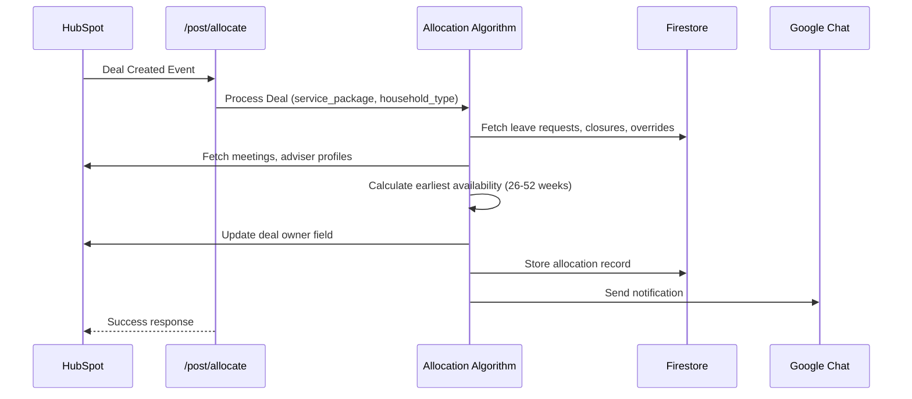
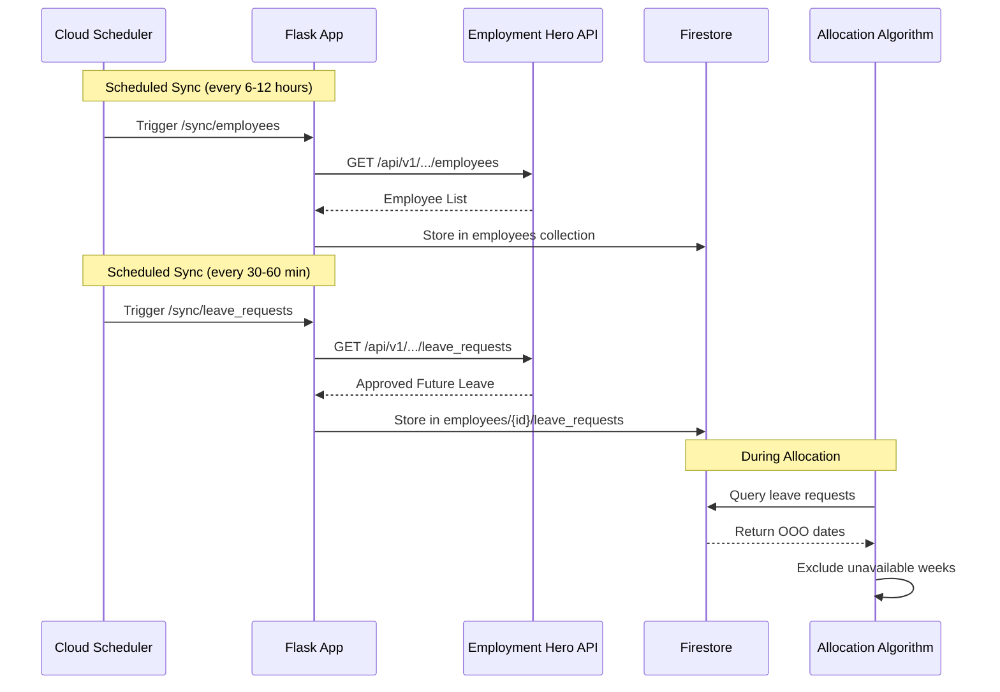
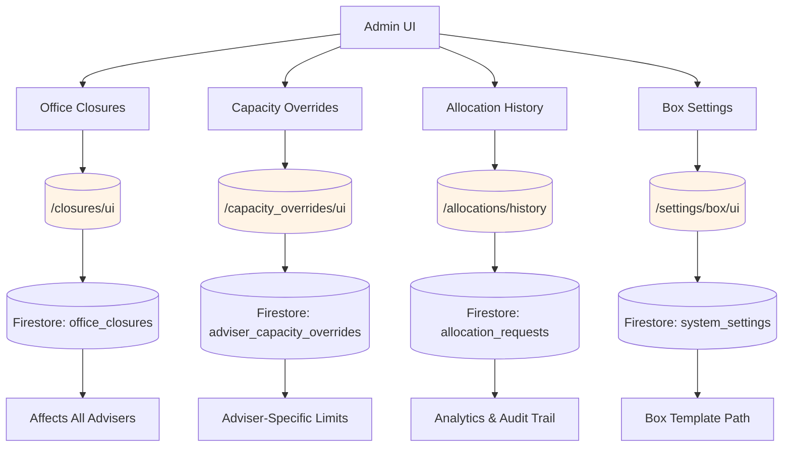

# Adviser Allocation Service

A production Flask app that allocates HubSpot deals to advisers based on capacity and availability.

**Key Features:**
- Employment Hero OAuth integration for employee and leave data
- Firestore-backed persistence for fast lookup
- Intelligent allocation algorithm (earliest-available adviser)
- Rate limiting, automatic retries, TTL-based caching
- 65 tests (100% pass rate), E2E coverage with Playwright

**Deployment:** Live at https://pivot-digital-466902.ts.r.appspot.com (CI/CD via Cloud Build)


## Features at a Glance

This system automates adviser allocation and client onboarding workflows with four core capabilities:

1. **[Adviser Allocation Automation](#allocation-system)** - Automatically assigns HubSpot deals to advisers based on capacity and availability
2. **[Box Folder Management](#box-document-management)** - Creates and tags client folders from deal creation webhooks
3. **[Availability Dashboards](#availability-management)** - Real-time visibility into adviser schedules, meetings, and capacity
4. **[Admin Configuration Tools](#admin--configuration)** - Manage office closures, capacity overrides, and allocation history
5. **[HR Integration](#hr-integration-employment-hero)** - Syncs employee data and leave requests from Employment Hero

→ [Jump to Architecture](#architecture)


## Quick Facts

| What | Details |
|------|---------|
| **GCP Project** | `pivot-digital-466902` (Project ID) |
| **Deployed At** | https://pivot-digital-466902.ts.r.appspot.com |
| **Platform** | Google App Engine Standard (Python 3.12) |
| **Region** | australia-southeast1 |
| **Service Name** | `default` (App Engine service) |
| **Current Version** | `main` (active version - 100% traffic) |
| **Database** | Google Cloud Firestore (multi-document ACID transactions) |
| **Secrets** | Google Secret Manager (`projects/307314618542/secrets/*/versions/latest`) |
| **Logging** | Google Cloud Logging (CloudLoggingHandler) |
| **Integrations** | Employment Hero (HR), HubSpot (CRM), Box (Document storage), Google Chat |
| **Authentication** | Employment Hero OAuth 2.0 + Session-based admin |
| **CI/CD** | Cloud Build (auto-trigger on git push, 65 tests as deployment gate) |
| **Instances** | Auto-scaled (Min: 1, Max: auto) - Check with `gcloud app instances list` |


## Features & Capabilities

### 🎯 Allocation System
**What it does:** Automatically assigns HubSpot deals to advisers based on earliest availability

**Data Sources:**
- HubSpot: Deal data, adviser meetings (Clarify/Kick Off), adviser details
- Firestore: Adviser capacity overrides, office closures, leave requests
- Employment Hero: Adviser leave/OOO status

**Behavior:**
- Considers capacity limits, meetings, leave requests, service packages
- Respects 2-week buffer and 52-week projection
- Sends Google Chat notifications on allocation (Google Chat API)
- Stores allocation records in Firestore (`allocation_requests` collection)

**Deployment:** Cloud Run via App Engine Standard, Python 3.12 runtime

**Workflow Diagram:**



### 👥 HR Integration (Employment Hero)
**What it does:** Syncs employee data and leave requests from Employment Hero HR system

**Data Flow:**
- OAuth 2.0 authentication (Employment Hero OAuth endpoints)
- Tokens stored in Firestore (`eh_tokens` collection)
- Employee data stored in Firestore (`employees` collection)
- Leave requests stored as sub-collections (`employees/{id}/leave_requests`)

**Sync Endpoints:**
- `/sync/employees` - Fetches all employees from Employment Hero
- `/sync/leave_requests` - Fetches future approved leave requests

**Workflow Diagram:**



**UI Views:**
- `/employees/ui` - Employee directory with search (Firestore-backed)
- `/leave_requests/ui` - Calendar view of upcoming leave

**Deployment:** Cloud Scheduler can trigger sync endpoints on schedule (recommended: every 1-12 hours)

### 📊 Availability Management
**What it does:** Calculates real-time adviser availability based on capacity, meetings, and leave

**Data Sources:**
- HubSpot: Meetings (Clarify/Kick Off counts), deal backlogs
- Firestore: Leave requests, capacity overrides, office closures
- Employment Hero: OOO/leave status

**Key Features:**
- Weekly capacity schedule breakdown per adviser
- Service package × household type matrix
- Capacity override management (Firestore-backed)
- Office closure/holiday tracking (affects all advisers)
- Multi-factor availability logic (meetings + leave + capacity)

**Dashboards:**
- `/availability/earliest` - Table of earliest-available advisers per service package
- `/availability/schedule?email=X&compute=1` - Weekly schedule for specific adviser
- `/availability/meetings?email=X` - Meeting list for specific adviser

**Workflow Diagram:**

```mermaid
graph LR
    A[Availability System] --> B[/availability/earliest]
    A --> C[/availability/schedule]
    A --> D[/availability/meetings]

    B --> E[Show Earliest Week per Adviser]
    C --> F[Weekly Schedule Breakdown]
    D --> G[Meeting Details List]

    E --> H[(Data Sources)]
    F --> H
    G --> H

    H --> I[HubSpot: Meetings, Deals, Users]
    H --> J[Firestore: Leave, Closures, Overrides]
    H --> K[Employment Hero: OOO Status]

    style B fill:#e1f5ff
    style C fill:#e1f5ff
    style D fill:#e1f5ff
```

**Deployment:** Runs on App Engine, queries Firestore and HubSpot API

### 📁 Box Document Management
**What it does:** Automates client folder creation and metadata tagging in Box

**GCP Integration:**
- Box JWT credentials stored in Google Secret Manager
- Folder metadata stored in Firestore (`box_metadata` tracking)
- Integration with HubSpot for deal details

**Workflows:**
- `/post/create_box_folder` - Creates folder from HubSpot workflow webhook
- `/box/folder/tag/auto` - Auto-applies metadata (fetches from HubSpot)
- `/box/folder/share` - Shares folders with specified email addresses

**Admin Features:**
- Metadata compliance scanning
- Mismatch detection and repair
- Collaborator management

**Workflow Diagram:**

```mermaid
flowchart TD
    A[HubSpot Deal Created] --> B{Which Webhook?}
    B -->|1. Create Folder| C[/box/folder/create]
    B -->|2. Apply Metadata| D[/box/folder/tag/auto]

    C --> E[Copy Box Template Folder]
    E --> F[Generate Client Folder Name]
    F --> G{Name Conflict?}
    G -->|Yes| H[Add suffix: 2, 3, ...]
    G -->|No| I[Create Folder]
    H --> I
    I --> J[Return Folder ID & URL]

    D --> K[Fetch Deal from HubSpot]
    K --> L[Build Metadata Dictionary]
    L --> M{All Required Fields?}
    M -->|No| N[Search HubSpot Contacts]
    M -->|Yes| O[Apply Metadata Template]
    N --> O
    O --> P[Update HubSpot Deal Property]
    P --> Q[Share Folder with Client]
```

**Deployment:** App Engine triggers Box API calls, integrates with Secret Manager for credentials

### 🔐 Admin & Configuration
**What it does:** Provides UI and API for managing adviser constraints and system settings

**Features:**
- **Office Closures** (`/closures/ui`) - Manage public holidays (stored in Firestore)
- **Capacity Overrides** (`/capacity_overrides/ui`) - Set adviser-specific capacity limits (stored in Firestore)
- **Allocation History** (`/allocations/history`) - Dashboard with filtering and analytics (queried from Firestore)
- **Session-based authentication** - Admin credentials in Secret Manager (`ADMIN_USERNAME`, `ADMIN_PASSWORD`)

**Data Storage:**
- Firestore `office_closures` collection
- Firestore `adviser_capacity_overrides` collection
- Firestore `allocation_requests` collection (read-only view)

**Configuration Diagram:**



**Deployment:** App Engine Standard, Flask-based admin UIs, Firestore-backed


## Key Endpoints

### Production Webhooks (HubSpot Integration)

| Endpoint | Method | Purpose |
|----------|--------|---------|
| `/post/allocate` | POST | Assign deal to earliest-available adviser |
| `/post/create_box_folder` | POST | Create Box client folder from deal data |
| `/box/folder/tag/auto` | POST | Apply metadata to Box folder |

### Availability & Monitoring

| Endpoint | Purpose |
|----------|---------|
| `/availability/earliest` | Show earliest-available advisers for each service package |
| `/availability/schedule?email=X&compute=1` | View weekly capacity for specific adviser |
| `/availability/meetings?email=X` | List Clarify/Kick Off meetings for adviser |
| `/allocations/history` | Dashboard of allocation history with filters |

### Data Sync (Scheduler-Friendly)

| Endpoint | Purpose |
|----------|---------|
| `/sync/employees` | Sync employee data from Employment Hero |
| `/sync/leave_requests` | Sync leave requests from Employment Hero |

### Admin UI (Protected)

| Endpoint | Purpose |
|----------|---------|
| `/closures/ui` | Manage office closures (holidays) |
| `/capacity_overrides/ui` | Manage adviser capacity overrides |
| `/employees/ui` | View employee directory |
| `/leave_requests/ui` | Calendar view of upcoming leave |
| `/box/create` | Box folder creation UI |

### Authentication

| Endpoint | Purpose |
|----------|---------|
| `/login` | Admin login page |
| `/auth/start` | Start Employment Hero OAuth flow |
| `/auth/callback` | OAuth callback handler |


## Requirements

- Python 3.12+ (for deployment; local dev supports 3.10+)
- Google Cloud credentials if using Firestore (Application Default Credentials)
- HubSpot Private App token with required scopes to read Users, Meetings, and Deals and update Deals

Install dependencies:

```bash
pip install -r requirements.txt
```

Install test dependencies:

```bash
pip install -r requirements-test.txt
```


## Configuration

Required environment variables (via `.env` or Secret Manager):

| Variable | Purpose | Example |
|----------|---------|---------|
| `EH_CLIENT_ID` | Employment Hero OAuth | (from EH) |
| `EH_CLIENT_SECRET` | Employment Hero OAuth secret | (from EH) |
| `HUBSPOT_TOKEN` | HubSpot API token | `pat-...` |
| `REDIRECT_URI` | OAuth callback URL | `https://app.example.com/auth/callback` |
| `BOX_JWT_CONFIG_JSON` | Box service account config | (JSON in Secret Manager) |
| `SESSION_SECRET` | Flask session encryption | (any random string) |

Optional:
- `USE_FIRESTORE`: Enable Firestore (default `true`)
- `BOX_IMPERSONATION_USER`: Box user email to impersonate
- `PRESTART_WEEKS`: Adviser start buffer (default `3` weeks)
- `PORT`: Server port (default `8080`)


## Infrastructure & Storage

### GCP Services & Resources

| Service | Resource | Purpose |
|---------|----------|---------|
| **App Engine** | Project: `pivot-digital-466902`, Service: `default`, Region: `australia-southeast1` | Hosts Flask application (Python 3.12 runtime) |
| **Firestore** | Database in `pivot-digital-466902` project | Primary data store (NoSQL) |
| **Secret Manager** | Project ID: `307314618542` (Cross-project secrets) | Stores credentials (EH, HubSpot, Box, admin passwords) |
| **Cloud Logging** | Logs for App Engine service `default` | Application logging and monitoring |
| **Cloud Build** | Trigger on git push to `main` branch | CI/CD pipeline (test gate + auto-deploy) |
| **Cloud Scheduler** | (Optional, user-configured) | Triggers `/sync/employees` and `/sync/leave_requests` on schedule |

### App Engine Deployment Details

**Instance Management:**
```bash
# View active instances
gcloud app instances list

# View versions and traffic split
gcloud app versions list
gcloud app services describe default
```

**Current Configuration:**
- **Runtime:** Python 3.12 (Standard Environment)
- **Instances:** Auto-scaled (minimum 1, maximum auto)
- **Memory:** 512 MB default per instance
- **Timeout:** 540 seconds (request timeout)
- **Entry Point:** `gunicorn -b :$PORT main:app`

### Database (Firestore)

**Project:** `pivot-digital-466902`

**Collections:**
| Collection | Purpose | Schema |
|-----------|---------|--------|
| `employees` | Employee data from Employment Hero | `{id, name, email, organisation_id, ...}` |
| `employees/{id}/leave_requests` | Leave requests per employee (subcollection) | `{start_date, end_date, type, status}` |
| `office_closures` | Global holidays/office closures | `{start_date, end_date, description, tags}` |
| `adviser_capacity_overrides` | Manual capacity limits per adviser | `{adviser_email, effective_date, client_limit_monthly}` |
| `allocation_requests` | Allocation history and analytics | `{deal_id, adviser_id, service_package, timestamp}` |
| `eh_tokens` | Employment Hero OAuth tokens | `{access_token, refresh_token, expires_at}` |

**Querying:**
```bash
# View collections in Cloud Firestore console
gcloud firestore databases list
```

### Google Cloud Logging

**Log Source:** `projects/pivot-digital-466902/logs/appengine.googleapis.com/default`

**View Logs:**
```bash
# Stream live logs
gcloud app logs tail -s default

# View specific version logs
gcloud app logs tail -s default --version=main
```

### External APIs

| API | Purpose | Authentication | Project Resource |
|-----|---------|-----------------|------------------|
| **Employment Hero** | Employee/leave data sync | OAuth 2.0 | Credentials in Secret Manager |
| **HubSpot** | Deal allocation, meetings, contacts | Private App Token | Portal ID: 47011873 |
| **Box** | Folder creation and metadata | JWT Service Account | Enterprise 260686117 |
| **Google Chat** | Allocation notifications | Webhook | Space: AAQADqcOrjo |

### Secrets (Google Secret Manager)

**Secret Path Format:** `projects/307314618542/secrets/{SECRET_NAME}/versions/latest`

| Secret | Purpose | Used By |
|--------|---------|---------|
| `EH_CLIENT_ID` | Employment Hero OAuth Client ID | oauth_service.py |
| `EH_CLIENT_SECRET` | Employment Hero OAuth secret | oauth_service.py |
| `HUBSPOT_TOKEN` | HubSpot API token (Private App) | allocation_routes.py, api calls |
| `BOX_JWT_CONFIG_JSON` | Box service account JSON config | box_routes.py |
| `SESSION_SECRET` | Flask session encryption | main.py |
| `ADMIN_USERNAME` | Admin UI login username | main.py auth |
| `ADMIN_PASSWORD` | Admin UI login password | main.py auth |
| `CHAT_WEBHOOK_URL` | Google Chat webhook for notifications | allocation_routes.py |

**View Secrets:**
```bash
gcloud secrets list --project=pivot-digital-466902
```


## Running Locally

```bash
export FLASK_APP=main.py
python main.py
# or
flask run -p 8080
```

If using Firestore locally, ensure ADC is configured:

```bash
gcloud auth application-default login
```

### Running Tests Locally

```bash
pytest --verbose
# with coverage
pytest --cov=. --cov-report=term-missing
```


## CI/CD Pipeline

**Cloud Build** automatically tests and deploys on every push:

```
Git Push → Run 65 Tests → IF PASS → Deploy to App Engine ✅
                       → IF FAIL → Block Deployment ❌
```

- **Testing Gate**: Deployment blocked if any test fails (prevents bad code in production)
- **Build Time**: ~1-3 minutes (with caching)
- **Current Status**: 9/10 score (see [CI_CD_SUMMARY.md](CI_CD_SUMMARY.md) for details)

Monitor builds:
```bash
gcloud builds list --limit=10
gcloud builds log BUILD_ID --stream
```


## Employment Hero OAuth Flow

1. Visit `http://localhost:8080/auth/start` to begin OAuth.
2. After callback (`/auth/callback`), tokens are saved (Firestore preferred; session fallback).
3. You can then call protected routes that fetch data from EH.


## Global Holidays / Office Closures

To block weeks for everyone (e.g., Christmas shutdown), add documents to the Firestore collection `office_closures` with fields:

- `start_date`: ISO date `YYYY-MM-DD`
- `end_date`: ISO date `YYYY-MM-DD` (optional; defaults to `start_date`)
- `description`: short text explaining the closure
- `tags`: optional list of short labels (e.g., `["public", "office"]`), also accepted as a comma-separated string

The system classifies each affected week as `Full` (5 business days) or `Partial: N` and folds this into adviser availability the same way personal leave is handled. Weeks classified as `Full` set target capacity to 0 for all advisers.

### Management Endpoints

- `GET /closures` → List current closures from `office_closures`.
- `POST /closures` (JSON) → Add a closure:
  - Body: `{ "start_date": "YYYY-MM-DD", "end_date": "YYYY-MM-DD", "description": "...", "tags": ["..."] }` (`end_date` optional; `tags` optional)
- `PUT /closures/<id>` (JSON) → Update a closure. Accepts `description`, `tags`, and dates.
- `DELETE /closures/<id>` → Delete a closure.
- `GET /closures/ui` → Admin UI to add and manage closures.

### Admin UI

- Topbar "Today" picker
- Add Closure card with live workdays (Mon–Fri) and a Tags input (with quick tag chips) before Description
- Closures table with:
  - Columns: `#`, `Description` (shows tags as badges above text), `Start Date`, `End Date`, `Workdays`, `Actions`
  - Inline edit: edit tags and description in-row

### Authentication

- Set `ADMIN_USERNAME` and `ADMIN_PASSWORD` (env or Secret Manager) to enable admin login.
- `GET/POST /admin/login` → Sign in to manage closures.
- `GET /admin/logout` → Sign out.
- The UI (`/closures/ui`) and modifying endpoints (`POST /closures`, `PUT/DELETE /closures/<id>`) require admin.


## HubSpot Allocation Webhook

- Endpoint: `POST /post/allocate`
- Expected payload: HubSpot workflow webhook for a Deal that includes `fields.service_package` and `fields.hs_deal_record_id`.
- Behavior:
  - Finds eligible advisers (HubSpot Users) taking on clients for the given `service_package`.
  - Pulls each adviser's recent meetings, deals that have no Clarify booked, and EH leave; then computes capacity and earliest availability.
  - Assigns the Deal to the adviser with the earliest open week (sets HubSpot owner on the Deal).

### Allocation Algorithm

Finds the earliest week an adviser can take the deal by:
1. Checking capacity constraints (meetings, leave, deal backlog)
2. Respecting a 2-week buffer before allocating
3. Projecting 52 weeks ahead to avoid bottlenecks

See [OPTIMIZATION_SUMMARY.md](OPTIMIZATION_SUMMARY.md) for technical details.


## Box Integration

- `POST /post/create_box_folder` provisions client folders (from HubSpot workflows)
- Credentials stored in Secret Manager (`BOX_JWT_CONFIG_JSON`), not in code
- Local dev: Set `BOX_JWT_CONFIG_PATH` to `config/box_jwt_config.json` (git-ignored)


## Scheduling (Recommended)

Run these on a schedule to keep Firestore fresh:

- Every 6–12 hours: `POST /sync/employees`
- Every 30–60 minutes (business hours): `POST /sync/leave_requests`

Example App Engine `cron.yaml` (if deployed on GAE):

```yaml
cron:
- description: sync employees
  url: /sync/employees
  schedule: every 12 hours

- description: sync leave requests
  url: /sync/leave_requests
  schedule: every 1 hours
```


## Troubleshooting

| Issue | Solution |
|-------|----------|
| OAuth fails | Verify `REDIRECT_URI` matches EH config exactly |
| Firestore errors | Set `USE_FIRESTORE=false` for local OAuth testing only |
| Allocation too early/late | Check system time, timezone, and adviser meeting data |
| Test failures | Run `pytest --verbose` to see full output; check Cloud Build logs for CI issues |


## Architecture

**Core Modules:**
- `core/allocation.py` - Deal allocation algorithm (capacity, availability)
- `services/oauth_service.py` - OAuth token lifecycle management
- `utils/http_client.py` - HTTP requests with auto-retry (3x, exponential backoff)
- `utils/cache_utils.py` - TTL-based caching (replaces indefinite @lru_cache)
- `middleware/rate_limiter.py` - Rate limiting (50 req/hour default)
- `utils/firestore_helpers.py` - Firestore CRUD operations

**Infrastructure:**
- **Database**: Firestore (employees, leaves, closures, capacity overrides)
- **APIs**: Employment Hero, HubSpot, Box (with automatic retries)
- **Testing**: 65 tests (unit + E2E with Playwright), 100% pass rate
- **Deployment**: Google App Engine with Cloud Build CI/CD

## Documentation

- [OPTIMIZATION_SUMMARY.md](OPTIMIZATION_SUMMARY.md) - Full optimization details and refactoring history
- [CI_CD_SUMMARY.md](CI_CD_SUMMARY.md) - CI/CD pipeline explanation (9/10 score)
- [DEPLOYMENT_VERIFICATION.md](DEPLOYMENT_VERIFICATION.md) - How to verify deployment and monitor health

## Change Management & Handover Guide

This section is for the next maintainer. Please follow these guidelines when making changes:

### Making Changes to This Project

**1. Before You Start**
- Read [OPTIMIZATION_SUMMARY.md](OPTIMIZATION_SUMMARY.md) to understand the architecture
- Understand the CI/CD process: all pushes to `main` trigger Cloud Build → Run 65 tests → Auto-deploy if tests pass
- Know that breaking changes to the API affect HubSpot webhooks, Employment Hero OAuth, and Box integrations

**2. Development Workflow**
```bash
# 1. Create a feature branch
git checkout -b feature/your-feature-name

# 2. Make changes
# 3. Run tests locally
pytest tests/ -v --cov=.

# 4. Commit with clear messages
git commit -m "Brief description of change"

# 5. Push to GitHub
git push origin feature/your-feature-name

# 6. Create a PR for review (if team workflow)
# 7. Once merged to main, Cloud Build auto-deploys
```

**3. Critical Infrastructure to Preserve**
- ⚠️ **Don't remove or rename**: `core/allocation.py`, `services/oauth_service.py`, `middleware/rate_limiter.py`
- ⚠️ **Don't modify without testing**: Firestore collections, Secret Manager references, environment variables
- ⚠️ **Always test before deploying**: New code affects production immediately (auto-deploy on main)

**4. Common Change Scenarios**

| Scenario | What to Do |
|----------|-----------|
| Add new feature | Follow CI/CD workflow, add tests, ensure 65 tests still pass |
| Update dependencies | Test thoroughly, update both `requirements.txt` and `requirements-test.txt`, verify no breaking changes |
| Add new Firestore collection | Document in README, add helper function in `utils/firestore_helpers.py`, write tests |
| Change API endpoint | Update HubSpot workflows that call it, test with mock payloads |
| Update OAuth flow | Test with real Employment Hero account, verify tokens still work |
| Add new secret | Add to Secret Manager, update `app.yaml` with reference, document in README |

**5. Deployment Process**

```bash
# The deployment is automatic:
1. Make changes locally
2. Commit to feature branch
3. Push to GitHub (git push origin branch-name)
4. Create PR / merge to main
5. Cloud Build automatically:
   ✅ Restores pip cache
   ✅ Installs dependencies
   ✅ Runs all 65 tests
   ✅ IF TESTS PASS → Deploys to App Engine
   ✅ IF TESTS FAIL → Blocks deployment (you must fix and re-push)

# Check deployment status:
gcloud builds list --project=pivot-digital-466902 --limit=5
```

**6. Emergency Fixes**

If production breaks after deployment:
```bash
# View current version
gcloud app versions list --project=pivot-digital-466902

# Check logs
gcloud app logs tail -s default --project=pivot-digital-466902

# Rollback to previous version
gcloud app services set-traffic default --splits=[OLD_VERSION]=1.0 --project=pivot-digital-466902

# Then fix code and re-deploy
git revert [bad-commit]  # or fix and create new commit
git push origin main     # Cloud Build will auto-deploy fix
```

**7. Key Contacts & Resources**

| Item | Location |
|------|----------|
| GCP Project | `pivot-digital-466902` |
| App URL | https://pivot-digital-466902.ts.r.appspot.com |
| Database | Firestore (australia-southeast1) |
| CI/CD | Cloud Build (configured in `cloudbuild.yaml`) |
| Secrets | Secret Manager (project `307314618542`) |
| GitHub Repo | Pivot-Wealth-Digital/adviser_allocation |

**8. What NOT to Do**

❌ **Don't commit secrets** - Use Secret Manager instead
❌ **Don't skip tests** - 65 tests must pass before deploying
❌ **Don't modify `app.yaml` region** - App Engine region is locked (australia-southeast1)
❌ **Don't force-push to main** - It will auto-deploy broken code
❌ **Don't delete Firestore collections** - Data loss is permanent

**9. Adding Documentation**

When you make changes, update:
- **README.md** - If you change features, endpoints, or configuration
- **OPTIMIZATION_SUMMARY.md** - If you change architecture or add modules
- **In-code comments** - For complex logic (keep it minimal)

**10. Questions or Issues?**

Refer to:
- [CI_CD_SUMMARY.md](CI_CD_SUMMARY.md) - CI/CD pipeline details
- [DEPLOYMENT_VERIFICATION.md](DEPLOYMENT_VERIFICATION.md) - Deployment commands
- [OPTIMIZATION_SUMMARY.md](OPTIMIZATION_SUMMARY.md) - Architecture deep-dive

## Diagrams

All workflow diagrams use [Mermaid](https://mermaid.js.org/) syntax and render automatically in GitHub, GitLab, and most markdown viewers. To edit:
- Use the [Mermaid Live Editor](https://mermaid.live/)
- Test changes before committing
- Keep diagrams simple (max 15 nodes for readability)

## License

Internal project.
