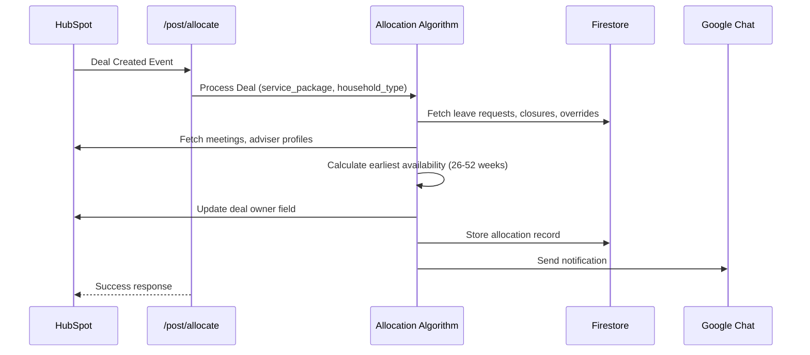
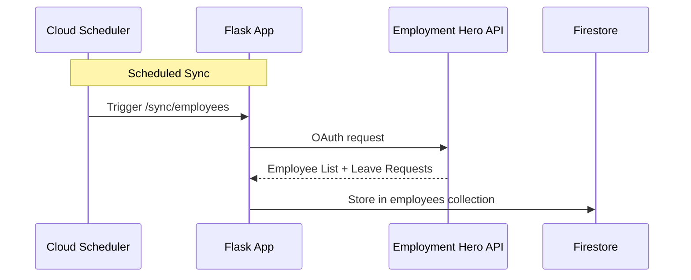
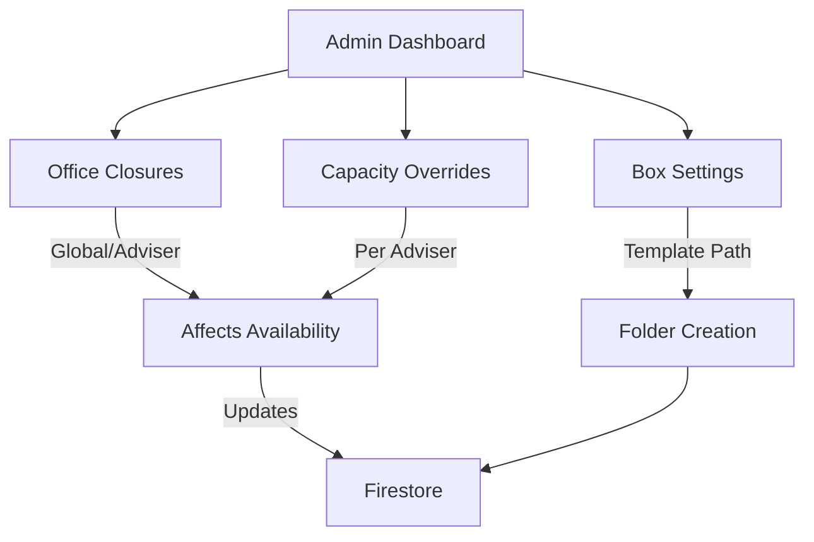

# Adviser Allocation Service

A production Flask application that automatically allocates HubSpot deals to advisers based on capacity and availability, with integrated Box folder provisioning and HR data synchronization.

**Deployment:** Live at https://pivot-digital-466902.ts.r.appspot.com | **CI/CD:** Cloud Build (65 tests as deployment gate)

---

## Quick Start

### Prerequisites
- Python 3.12+
- Google Cloud credentials (Application Default Credentials)
- HubSpot Private App token
- Employment Hero OAuth credentials

### Run Locally

```bash
pip install -r requirements.txt
export FLASK_APP=main.py
python main.py
# Visit http://localhost:8080
```

### Deploy to App Engine

```bash
gcloud app deploy
```

See [Configuration Guide](docs/CONFIGURATION.md) for environment variable setup.

---

## Features at a Glance

| Feature | Purpose | Documentation |
|---------|---------|---------------|
| **Adviser Allocation** | Automatically assign HubSpot deals to advisers based on earliest availability | [Architecture](ARCHITECTURE.md#allocation-algorithm) |
| **Availability Dashboard** | Real-time view of adviser schedules, capacity, and meetings | [User Guide](docs/USER_GUIDE.md#adviser-schedule) |
| **Box Folder Management** | Create and tag client folders from HubSpot deals | [User Guide](docs/USER_GUIDE.md#box-folder-provisioning) |
| **Admin Tools** | Manage office closures, capacity overrides, Box settings | [User Guide](docs/USER_GUIDE.md#admin-tools) |
| **HR Integration** | Sync employees and leave requests from Employment Hero | [Integrations](docs/INTEGRATIONS.md#employment-hero) |

---

## Quick Facts

| What | Details |
|------|---------|
| **GCP Project** | `pivot-digital-466902` |
| **Platform** | Google App Engine Standard (Python 3.12) |
| **Region** | `australia-southeast1` |
| **Database** | Google Cloud Firestore |
| **CI/CD** | Cloud Build (auto-deploy on main branch) |
| **Tests** | 65 tests (100% pass rate required for deployment) |
| **Integrations** | HubSpot (CRM), Employment Hero (HR), Box (Documents), Google Chat (Notifications) |

---

## How It Works

### For End Users (Operators)

- **📊 View Availability** - Check adviser schedules and earliest available weeks
- **🎯 Manage Allocations** - See allocation history and dealowner assignments
- **⚙️ Admin Tools** - Add office closures, adjust capacity overrides, configure Box settings

👉 **Start here:** [User Guide](docs/USER_GUIDE.md)

### For Developers

- **🏗️ Architecture** - System design, allocation algorithm, core modules
- **📡 API Reference** - All endpoints, webhooks, request/response formats
- **⚙️ Configuration** - Environment variables, secrets, OAuth setup
- **🚀 Operations** - Cloud Scheduler, monitoring, troubleshooting
- **🔗 Integrations** - HubSpot, Employment Hero, Box, Google Chat

👉 **Start here:** [Documentation Index](docs/README.md)

---

## Architecture Overview

### Allocation System



### HR Data Sync



### Availability Dashboard

```mermaid
graph LR
    A[Availability System] --> B[/availability/earliest]
    A --> C[/availability/schedule]
    A --> D[/availability/meetings]

    B --> E[Earliest Week per Adviser]
    C --> F[Weekly Schedule Details]
    D --> G[Meeting List]

    E --> H[(Data Sources)]
    F --> H
    G --> H

    H --> I[HubSpot: Meetings, Deals]
    H --> J[Firestore: Leave, Closures]
    H --> K[Employment Hero: OOO Status]

    style B fill:#e1f5ff
    style C fill:#e1f5ff
    style D fill:#e1f5ff
```

### Box Folder Provisioning

```mermaid
flowchart TD
    A[HubSpot Deal Created] -->|Webhook| B[/post/create_box_folder]
    B -->|Copy Template| C[Create Folder in Box]
    C -->|Apply Metadata| D[Tag with Deal Info]
    D -->|Share| E[Grant Client Access]
    E -->|Update HubSpot| F[Store Box URL in Deal]
    F --> G[Google Chat Notification]
```

### Admin Configuration



---

## Key Integrations

| Service | Purpose | Setup |
|---------|---------|-------|
| **HubSpot** | CRM (deals, contacts, meetings) | [HubSpot Setup](docs/CONFIGURATION.md#hubspot-configuration) |
| **Employment Hero** | HR (employees, leave requests) | [EH Setup](docs/CONFIGURATION.md#employment-hero-oauth-setup) |
| **Box** | Document storage (client folders) | [Box Setup](docs/CONFIGURATION.md#box-configuration) |
| **Google Chat** | Notifications (allocation alerts) | [Chat Setup](docs/CONFIGURATION.md#google-chat-integration) |

---

## Documentation

### User Documentation
- [User Guide](docs/USER_GUIDE.md) - Dashboards, admin tools, workflows
- [Box Folder Workflow](docs/box-folder-workflow.md) - Folder provisioning details

### Developer Documentation
- [Architecture](ARCHITECTURE.md) - System design, allocation algorithm, modules
- [API Reference](docs/API_REFERENCE.md) - All endpoints and webhooks
- [Configuration](docs/CONFIGURATION.md) - Environment setup, secrets, OAuth
- [Operations](docs/OPERATIONS.md) - Cloud Scheduler, monitoring, troubleshooting
- [Integrations](docs/INTEGRATIONS.md) - Integration details and troubleshooting
- [Infrastructure](docs/INFRASTRUCTURE.md) - GCP services, Firestore, secrets
- [Contributing](docs/CONTRIBUTING.md) - Development workflow, testing

### Reference
- [CI/CD Summary](CI_CD_SUMMARY.md) - Build pipeline details
- [Deployment Verification](DEPLOYMENT_VERIFICATION.md) - Verification checklist
- [Skills Framework](docs/SKILLS_FRAMEWORK.md) - Custom skills system
- [Changelog](docs/CHANGELOG.md) - Version history

---

## Troubleshooting

| Issue | Solution |
|-------|----------|
| OAuth fails | Verify `REDIRECT_URI` matches Employment Hero config exactly |
| Firestore errors | Set `USE_FIRESTORE=false` for local OAuth testing |
| Tests fail | Run `pytest tests/ -v` to see full output |
| Allocation not working | Check HubSpot API token is valid and advisers exist in Firestore |

👉 **Full troubleshooting guide:** [Operations](docs/OPERATIONS.md#troubleshooting)

---

## Requirements

- Python 3.12+
- Google Cloud Project (pivot-digital-466902)
- 65 tests must pass before deployment
- All endpoints require authentication (except webhooks)

---

## License

Internal project.
