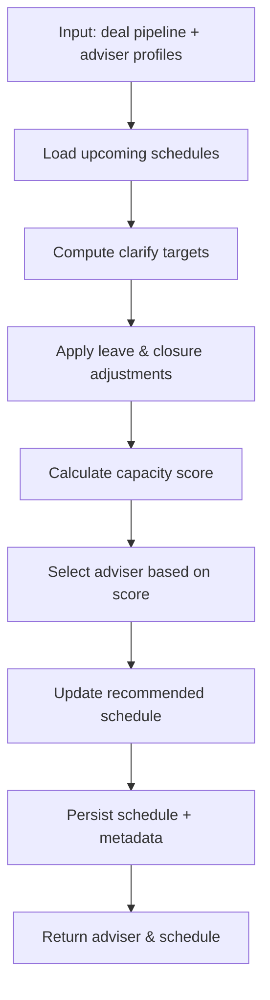

# Adviser Allocation Platform – User Guide

This guide explains how to work with every major feature of the Adviser Allocation platform, from checking capacity to managing allocations. Keep it open alongside the app for quick reference.

---

## 1. Getting Started

1. **Login** with your team credentials. The system enforces authentication for all features except the inbound webhooks.
2. **Home Dashboard** highlights the primary tools:
   - *View Earliest Availability*
   - *View Adviser Schedule*
   - *Availability Matrix*
   - *Client Allocation*
   - *Allocation History*
   - *Manage Closures*
3. The top right status card shows the app version, environment, and current Sydney time.

---

## 2. Adviser Earliest Availability

Open **View Earliest Availability** to locate the next week each adviser can onboard a new client.

### Inputs
- **Agreement Start Date** – re-centres the scheduling window.
- **Include Non-Taking Advisers** – optionally list advisers marked as “Not taking clients”.

### Table Columns
- *Taking On Clients* – “Yes/No” derived from pod settings and closures.
- *Service Packages* & *Household Type* – rendered as tags; use them to match deal requirements.
- *Client Monthly Limit* – fortnight target translated to monthly capacity.
- *Earliest Open Week* & *Monday Date* – the first week where backlog clears.

### Pro Tips
- Hover the info tooltip above the form to recall how backlog, closures, and fortnight targets roll together.
- Sort columns by clicking the headers; clarifies and limits use numeric sorting.
- If no advisers appear, the current filters exclude them (check “Include Non-Taking Advisers” or move the start date).

---

## 3. Adviser Schedule

Use **View Adviser Schedule** to inspect weekly capacity for a single adviser and perform what‑if edits.

### Compute Controls
- Select an adviser and an agreement start date; click *Compute Schedule*.
- A loading indicator confirms the request—data is fetched after each button press.

### Table Details
- *Clarify Count* – number of clarify meetings scheduled that week.
- *OOO* – summarised closures; “Full” indicates zero capacity.
- *Deal No Clarify* – deals lacking a scheduled clarify session.
- *Target*, *Actual*, *Difference* – fortnight target vs total clarifies (including carry‑over).
- Highlighted row marks the earliest week available.

### Edit Mode
1. Click **Edit** to modify clarify and deal counts directly in the table.
2. **Done** recalculates totals and exits edit mode; **Reset** restores the original values.
3. Overflow (Actual > Target) propagates forward, so positive differences shift the earliest-available week.

---

## 4. Admin Tools

### 4.1 Manage Closures

Closures affect both availability and scheduling calculations for advisers.

#### Adding Office Closures

1. Open **Manage Closures** (`/closures/ui`)
2. Click **Add New Closure**
3. Fill in the following:
   - **Start Date** – First day of closure (required)
   - **End Date** – Last day of closure (required; can be same day for single-day closures)
   - **Description** – Brief explanation (e.g., "Public Holiday - Australia Day")
   - **Tags** – Comma-separated labels for reporting (e.g., "Public Holiday", "Office Maintenance", "Training")
   - **Scope** – Choose one:
     - **Global** – Affects all advisers (office-wide closures)
     - **Adviser Email** – Affects specific adviser only (personal leave, sick leave, training)

4. Click **Save**

#### How Closures Affect Scheduling

- **One-day closure** – Zeroes capacity for that specific day within the week
- **Multi-day closure** – Marks entire week as unavailable (reduces weekly capacity)
- **Global vs Personal** – Global closures apply to all advisers; personal closures only affect that adviser
- **Availability calculation** – The earliest-available algorithm automatically skips weeks with closures

#### Common Closure Types

| Type | Scope | Example |
|------|-------|---------|
| Public Holiday | Global | Australia Day (Jan 26), Christmas (Dec 25) |
| Office Closure | Global | Office renovations, building maintenance |
| Annual Leave | Adviser | Holidays, vacation (multi-day) |
| Sick Leave | Adviser | Medical appointments, illness |
| Training | Adviser or Global | Team training days, upskilling |

#### Viewing & Editing Closures

- **List view** shows all closures sorted by date
- **Filter** by scope (Global/Adviser), date range, or tags
- **Edit** any closure by clicking the row (updates take effect immediately)
- **Delete** to remove a closure (only available for future dates)

### 4.2 Adviser Capacity Overrides

Fine-tune adviser capacity limits without changing global settings.

#### Setting Capacity Overrides

1. Open **Capacity Overrides** (`/capacity_overrides/ui`)
2. Click **Add Override**
3. Configure:
   - **Adviser Email** – Select from dropdown (required)
   - **Effective Date** – When override takes effect (required)
   - **Client Limit** – Maximum clients for fortnight target (replaces global setting)
   - **Reason** – Optional note (e.g., "Temporary reduction due to training", "Promotion to team lead")

4. Click **Save**

#### Use Cases

- **Temporary reduction** – Adviser taking on training duties, mentoring, or project work
- **Temporary increase** – Adviser available for extra capacity during slow periods
- **Long-term adjustment** – Promotion, role change, or sabbatical preparation
- **Ramp-up** – New adviser starting at lower capacity, gradually increasing

#### How Overrides Work

- **Effective Date** – Override applies from specified date forward until explicitly ended
- **Priority** – Capacity override takes precedence over global settings
- **Immediate effect** – Changes reflected instantly in availability calculations
- **Removing overrides** – Click **Delete** to remove and revert to global settings

#### Monitoring Overrides

- View all active overrides with their effective dates
- See which advisers have temporary adjustments
- Review historical overrides to identify patterns

---

## 5. Allocation Workflow

### Allocation Webhook (`POST /post/allocate`)
- Receives HubSpot deal payloads.
- Picks the next available adviser based on package, household type, and agreement start date.
- Updates the HubSpot deal owner, persists the record (including metadata such as IP and User-Agent), and optionally emits a Google Chat alert.

### Manual Allocation Review
- Use **Client Allocation** to trigger allocations (mainly for testing).
- **Allocation History** lists recent decisions with deal metadata and links to HubSpot.

---

## 6. Environment & Configuration Checklist

| Setting | Location | Notes |
|---------|----------|-------|
| `HUBSPOT_TOKEN` | `.env` / Secret Manager | Must be a valid private app token; needed for availability, schedule, and allocation queries. |
| `HUBSPOT_PORTAL_ID` | `.env` / Cloud Run env vars | Drives HubSpot links in in-app navigation. |
| Google Chat webhook URL | `.env` / Secret Manager | Controls allocation notifications. |

After editing configuration, redeploy Cloud Run (or restart the local Flask server) to load the new values.

---

## 7. FAQ Recap (Scheduling Focus)

- **Partial-week leave** – Add a closure for the specific days; capacity is reduced only for those dates.
- **Solo vs Full Pods** – Solo pods have lower fortnight targets; availability views embed the right target automatically.
- **Overflow handling** – Excess clarifies rolling forward increase the "Difference" column and push earliest availability forward.
- **"Deal No Clarify" column** – Shows deal count awaiting clarify meetings.

---

## 8. Troubleshooting Quick Reference

| Symptom | Cause | Fix |
|---------|-------|-----|
| `HUBSPOT_TOKEN is not configured` | Token missing in env | `set -a && source .env` locally, update Secret Manager / Cloud Run env vars in production and redeploy. |
| Availability tables empty | Filters exclude all advisers | Check agreement start date, enable "Include Non-Taking Advisers", verify closures. |
| Schedule numbers incorrect after edits | Edit mode still active or data cached | Click *Done*, reload the page, or recompute from the start date. |

---

Need a feature walkthrough that’s not covered here? Open an issue or ping the engineering channel—this guide will be updated as the platform evolves.

