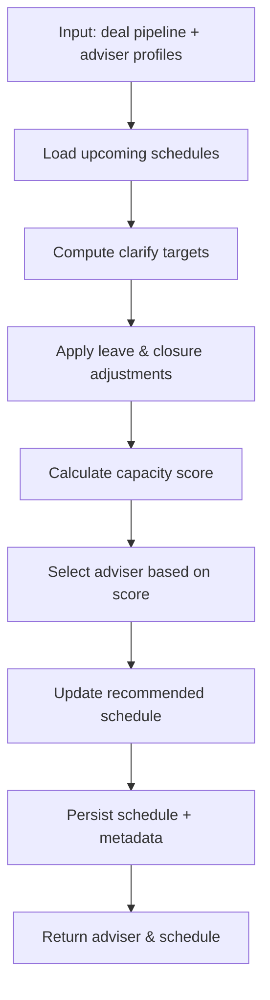

# Adviser Allocation Platform – User Guide

This guide explains how to work with every major feature of the Adviser Allocation platform, from checking capacity to provisioning Box client folders. Keep it open alongside the app for quick reference.

---

## 1. Getting Started

1. **Login** with your team credentials. The system enforces authentication for all features except the inbound webhooks.
2. **Home Dashboard** highlights the primary tools:
   - *View Earliest Availability*
   - *View Adviser Schedule*
   - *Availability Matrix*
   - *Client Allocation*
   - *Allocation History*
   - *Create Box Folder*
   - *Manage Closures*
3. The top right status card shows the app version, environment, and current Sydney time.

---

## 2. Adviser Earliest Availability

Open **View Earliest Availability** to locate the next week each adviser can onboard a new client.

### Inputs
- **Agreement Start Date** – re-centres the scheduling window.
- **Include Non-Taking Advisers** – optionally list advisers marked as “Not taking clients”.

### Table Columns
- *Taking On Clients* – “Yes/No” derived from pod settings and closures.
- *Service Packages* & *Household Type* – rendered as tags; use them to match deal requirements.
- *Client Monthly Limit* – fortnight target translated to monthly capacity.
- *Earliest Open Week* & *Monday Date* – the first week where backlog clears.

### Pro Tips
- Hover the info tooltip above the form to recall how backlog, closures, and fortnight targets roll together.
- Sort columns by clicking the headers; clarifies and limits use numeric sorting.
- If no advisers appear, the current filters exclude them (check “Include Non-Taking Advisers” or move the start date).

---

## 3. Adviser Schedule

Use **View Adviser Schedule** to inspect weekly capacity for a single adviser and perform what‑if edits.

### Compute Controls
- Select an adviser and an agreement start date; click *Compute Schedule*.
- A loading indicator confirms the request—data is fetched after each button press.

### Table Details
- *Clarify Count* – number of clarify meetings scheduled that week.
- *OOO* – summarised closures; “Full” indicates zero capacity.
- *Deal No Clarify* – deals lacking a scheduled clarify session.
- *Target*, *Actual*, *Difference* – fortnight target vs total clarifies (including carry‑over).
- Highlighted row marks the earliest week available.

### Edit Mode
1. Click **Edit** to modify clarify and deal counts directly in the table.
2. **Done** recalculates totals and exits edit mode; **Reset** restores the original values.
3. Overflow (Actual > Target) propagates forward, so positive differences shift the earliest-available week.

---

## 4. Manage Closures

Closures affect both availability and scheduling.

- Add single- or multi-day leave blocks for advisers or global holidays.
- Specify tags such as “Public Holiday” or “Office Maintenance” for reporting.
- All scheduling views respect closures automatically; one-day leave zeros that specific day, while multi-day leave wipes the full week.

---

## 5. Allocation Workflow

### Allocation Webhook (`POST /post/allocate`)
- Receives HubSpot deal payloads.
- Picks the next available adviser based on package, household type, and agreement start date.
- Updates the HubSpot deal owner, persists the record (including metadata such as IP and User-Agent), and optionally emits a Google Chat alert.
- Box folder creation is no longer triggered automatically—see the next section.

### Manual Allocation Review
- Use **Client Allocation** to trigger allocations (mainly for testing).
- **Allocation History** lists recent decisions with deal metadata and links to HubSpot.

---

## 6. Box Folder Provisioning

### UI (`/box/create`)
- Enter a deal ID and click *Preview Folder Details*.
- Review the recommended folder name, contact list, and metadata (deal salutation, household type, contact IDs, HubSpot links).
- Adjust any fields (e.g., add spouse link overrides) and click *Create Folder*.
- The response displays the Box folder ID, friendly name, metadata keys applied, and the direct Box URL.

### API (`POST /post/create_box_folder`)
```bash
curl -X POST https://<app>/post/create_box_folder \
  -H 'Content-Type: application/json' \
  -d '{ "deal_id": "47110952883" }'
```
- Only `deal_id` is mandatory; the server fetches everything else from HubSpot.
- Optional keys: `folder_name` (override), `metadata` (preferred fields match the UI: salutation, household type, primary/spouse contact IDs and links, associated contact IDs as a list).
- Duplicate guard: if Box metadata already has a matching primary contact link, the existing folder is reused and its metadata refreshed.

### Metadata Template (Box)
- Fields retained: `Household Type`, `Deal Salutation`, `Primary Contact Link`, `Spouse Contact Link`, `Associated Contact IDs`, `Associated Contacts`.
- Links use the configured `HUBSPOT_PORTAL_ID` (currently `47011873`). Update the env var if the portal changes.

---

## 7. Environment & Configuration Checklist

| Setting | Location | Notes |
|---------|----------|-------|
| `HUBSPOT_TOKEN` | `.env` / Secret Manager | Must be a valid private app token; needed for availability, schedule, and Box metadata queries. |
| `HUBSPOT_PORTAL_ID` | `.env`, `app.yaml` | Drives HubSpot links inside Box metadata and in-app navigation. |
| `BOX_METADATA_SCOPE`, `BOX_METADATA_TEMPLATE_KEY` | `.env`, `app.yaml` | Needed to apply the Box metadata template. |
| `BOX_WEBHOOK_PRIMARY_SECRET` etc. | `.env` | Required for Box automation. |
| Google Chat webhook URL | `.env` | Controls allocation notifications. |

After editing configuration, redeploy App Engine (or restart the local Flask server) to load the new values.

---

## 8. FAQ Recap (Scheduling Focus)

- **Partial-week leave** – Add a closure for the specific days; capacity is reduced only for those dates.
- **Solo vs Full Pods** – Solo pods have lower fortnight targets; availability views embed the right target automatically.
- **Overflow handling** – Excess clarifies rolling forward increase the “Difference” column and push earliest availability forward.
- **“Deal No Clarify” column** – Shows deal count awaiting clarify meetings; use the Box folder metadata to confirm whether the client has been provisioned.
- **Box metadata missing?** – Ensure `BOX_METADATA_SCOPE/TEMPLATE_KEY` are set and that the metadata template in Box matches the preferred field list; redeploy if changes were made.
- **Multiple Box folders created?** – Older folders without the new metadata fields won’t trip the duplicate guard. Recreate once, confirm metadata is present, and remove extras manually.

---

## 9. Troubleshooting Quick Reference

| Symptom | Cause | Fix |
|---------|-------|-----|
| `HUBSPOT_TOKEN is not configured` | Token missing in env | `set -a && source .env` locally, update Secret Manager/`app.yaml` in production and redeploy. |
| Box response shows `409 item_name_in_use` | Folder already exists | Duplicate guard should detect existing metadata; if not, ensure metadata template is synced and rerun. |
| Box metadata blank | Template scope/key unset or template outdated | Update Box template to the preferred fields and confirm env variables are present, then recreate. |
| Availability tables empty | Filters exclude all advisers | Check agreement start date, enable “Include Non-Taking Advisers”, verify closures. |
| Schedule numbers incorrect after edits | Edit mode still active or data cached | Click *Done*, reload the page, or recompute from the start date. |

---

Need a feature walkthrough that’s not covered here? Open an issue or ping the engineering channel—this guide will be updated as the platform evolves.


